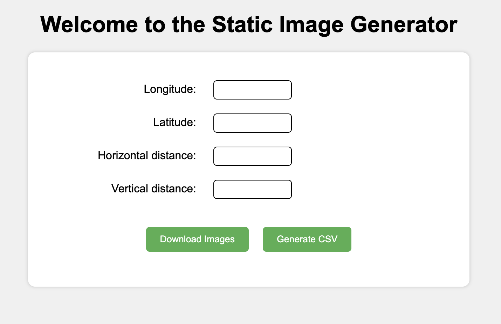

# Static Image Generator

This JavaScript code allows you to download a set of satellite images from Google Maps API, given the latitude, longitude, and dimensions of the area you want to download. When entering a starting coordinate, use the most north western point of the area you require coverage over.



## Dependencies

The following dependencies are required:

- jQuery
- SweetAlert2
- JSZip
- FileSaver.js

## Setup

1. Clone the repository or copy the code into a new project directory.
2. Install the dependencies listed above by running the yarn command in terminal.

```
yarn
```

3. Create a new file named constants.js in the same directory as index.js.
4. In constants.js, define your GOOGLE_API_KEY value and incrementor (see 'Incrementing distance between images' at bottom for info on incrementations) as shown below.

```
   export const GOOGLE_API_KEY = "your_google_maps_api_key_here"
   export const incrementor = 0.01
```

5. To create `dist` build folder, run the following in your terminal

```
yarn run build
```

## Usage

1. Open index.html in your web browser, in vs code you can open the index.html and select the GoLive feature to easily start a local web server and preview the project in your browser.
2. Enter the latitude and longitude of the area you want to download, as well as the surface area dimensions you would like to cover.
3. Click the "Download Images" button to download a .zip file containing the requested images, this may take a minute depending on size of area.
4. Click the "Generate CSV" button to download a CSV file populated with coordinates data.

## Incrementing distance between images

On a Google Map coordinate, each decimal place corresponds to a different level of precision in the location data. The decimal places in the latitude and longitude coordinates represent progressively smaller units of distance as follows:

0.1 degrees, is approximately 11.1 kilometers (6.9 miles) at the equator.
0.01 degrees, is approximately 1.1 kilometers (0.69 miles) at the equator.
0.001 degrees, is approximately 111 meters (364 feet) at the equator.
0.0001 degrees, is approximately 11.1 meters (36 feet) at the equator.
0.00001 degrees, is approximately 1.1 meters (3.6 feet) at the equator.
0.000001 degrees, is approximately 0.11 meters (4.4 inches) at the equator.
